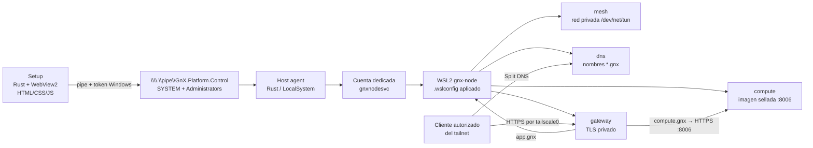

# Arquitectura base — GnX Node

> Estado: arquitectura base aprobada para implementación. Define un proyecto nuevo; no hereda código, nombres, monitor HTTP, endpoints loopback, PWA de sesión ni provisionador del checkout actual.

## 1. Decisión

**GnX Node** es un instalable Windows que crea una identidad Windows dedicada y su distribución WSL2 dedicada, `gnx-node`. En ella instala Podman y activa Quadlets para **Tailscale, Pi-hole, Caddy y Proxmox entregado como imagen sellada**. Los clientes autorizados del tailnet consumen:

- `https://app.gnx` — PWA de aplicación.
- `https://compute.gnx` — interfaz HTTPS de Proxmox, puerto interno `8006`.

El control privilegiado no usa HTTP localhost: no hay `127.0.0.1:17890`, `/status` ni POST de secretos. El servicio Rust y el cliente administrativo local se comunican únicamente por un **Windows Named Pipe** con ACL.

La experiencia humana de alta es una aplicación local Rust + **WebView2**, con HTML/CSS/JS. Muestra pasos, progreso, reinicio requerido, errores accionables y recuperación. La PWA que sirve `app.gnx` es una aplicación de navegador sin privilegios: no abre pipes, no controla WSL ni recibe la clave Tailscale.

### Premisas cerradas por POC

No son preguntas de diseño ni trabajo exploratorio:

- una cuenta Windows dedicada puede poseer y operar su registro aislado de la distro `gnx-node`;
- el transporte controlado bajo esa identidad funciona sin adoptar distros de otros usuarios;
- `.wslconfig` con virtualización anidada produce `/dev/kvm` funcional en el host objetivo;
- la imagen sellada de Proxmox arranca dentro de ese entorno y responde HTTPS en `8006`.

La implementación productiva debe reproducir esas condiciones, convertirlas en pruebas automatizadas y fallar con diagnóstico si un host no cumple. No debe rediseñar ni reabrir estas decisiones.

## 2. Experiencia de instalación: paquete para instalar, Setup para operar

El provisioning largo no vive dentro de la transacción MSI. WSL, descargas de imágenes, systemd y un posible reinicio requieren estado recuperable fuera de Windows Installer.


| Capa         | Tecnología         | Responsabilidad                                                                                                     |
| ------------ | ------------------ | ------------------------------------------------------------------------------------------------------------------- |
| Bootstrapper | Burn               | Elevación, prerequisitos y errores previos; encadena el MSI y lanza Setup.                                          |
| Servicio     | Rust / LocalSystem | Ejecutar operaciones autorizadas, persistir estado reducido, crear cuenta/distro y reconciliar WSL.                 |
| Setup        | Rust + WebView2    | Progreso, errores, reintentos y entrada efímera de clave Tailscale. No ejecuta acciones privilegiadas directamente. |
| Aplicación   | PWA en `app.gnx`   | Producto de usuario; no participa en instalación ni entrega secretos.                                               |


**Límite único:** Burn/MSI termina al copiar/verificar archivos y registrar el servicio; Setup empieza el provisioning. No comparten pasos ni barras de progreso. Tras reiniciar, el servicio continúa desde su checkpoint y Setup vuelve a representar ese estado por el pipe.

### Vista de progreso

Setup presenta una línea de tiempo, no logs crudos:

```text
[✓] Preparar Windows       [✓] Crear identidad GnX
[•] Preparar WSL           [ ] Instalar runtime Linux
[ ] Unir al tailnet        [ ] Publicar app.gnx / compute.gnx

Preparar WSL necesita reiniciar Windows.
[Reiniciar ahora]  [Cerrar; continuaré automáticamente]
```

La implementacion nativa de Setup mantiene una allowlist exacta de los cinco
metodos publicos y de los recursos `gnx://ui/{index.html,styles.css,app.js}` y
`gnx://bridge`. El puente limita el cuerpo a 8 KiB y transmite unicamente una
referencia a un archivo efimero; el agente comprueba version, tamano, replay,
operacion y transicion antes de consumirlo. El archivo se elimina tras exito,
fallo o timeout, y el arranque del servicio barre los nombres de staging
conocidos para cubrir reinicio.

El progreso puede incluir la IP privada del nodo y la de Pi-hole como campos
separados, sin inferencia en la UI, ademas de acciones acotadas
`CONFIGURE_SPLIT_DNS` (zona `gnx`) y `TRUST_PRIVATE_CA` (certificado publico).
La clave privada de la CA de producto queda bajo ACL de `SYSTEM`/`Administrators`
en `%ProgramData%\\GnX\\Node\\state\\ca`.

Cada fase tiene `estado`, `título humano`, `detalle seguro`, `acción recomendada`, `operationId` y diagnóstico sanitizado. Un error nunca muestra una clave, contraseña, comando expandido o configuración secreta. Las únicas acciones son `GetProgress`, `Provision`, `JoinMesh`, `Retry` y `Cancel`; no existe ejecución arbitraria ni una segunda API de reparación.

## 3. Objetivos y límites

### Objetivos

1. Instalar un servicio Windows de inicio automático y una UI administrativa local legible.
2. Crear o validar solo una cuenta local marcada como propiedad de GnX; nunca adoptar una cuenta ajena.
3. Registrar y administrar exclusivamente la distro `gnx-node`, no distros de usuarios.
4. Aplicar un archivo `.wslconfig` versionado del repositorio al perfil de la identidad dedicada, validándolo antes de reiniciar WSL.
5. Instalar Podman y Quadlets externos; Rust orquesta archivos, no contiene configuración empotrada.
6. Solicitar una clave `tskey-auth-*` una sola vez en Setup y entregarla solo por Named Pipe.
7. Publicar Split DNS privado `gnx`, `https://app.gnx` y `https://compute.gnx` solo por Tailscale.
8. Ejecutar la capacidad de negocio `compute` como un Quadlet desde la imagen sellada de Proxmox, con HTTPS interno `8006` validado por el gateway.

### Fuera de alcance

- HTTP de administración local o remota.
- Sesiones de PWA, backend SaaS, sync, SOCKS o navegador privilegiado.
- Configuración, Caddyfiles, scripts, Quadlets o secretos incluidos como strings/base64 en Rust.
- DNS público, puertos de router/LAN o TLS inseguro.

## 4. Componentes y límites de confianza




| Componente    | Privilegio                          | Hace                                                                   | No hace                                                |
| ------------- | ----------------------------------- | ---------------------------------------------------------------------- | ------------------------------------------------------ |
| Setup         | Administrador interactivo           | Progreso, errores, consentimiento, clave efímera y solicitudes al pipe | Ejecutar WSL ni abrir puertos                          |
| Host agent    | LocalSystem                         | Cuenta, estado, WSL, rutina Linux y control de ciclo de vida           | Exponer una API de red o aceptar cliente no autorizado |
| `gnxnodesvc`  | Sin login interactivo               | Propietaria de la distro y de las operaciones WSL delegadas            | Administrar Windows o acceder a secretos ajenos        |
| `gnx-node`    | Root solo durante bootstrap/systemd | Podman, Quadlets y nftables                                            | Cambiar Windows fuera del canal autorizado             |
| PWA `app.gnx` | Navegador                           | Aplicación de usuario                                                  | Leer pipe, secretos o administrar el nodo              |


## 5. Canal de control y secretos

El único canal de Setup al host agent es `\\.\pipe\GnX.Platform.Control`.

- DACL explícita: `SYSTEM` y `Administrators`; sin `Everyone`, `Users` ni anónimo.
- El agente valida token de Windows, rol administrador, versión de protocolo, tipo de mensaje, tamaño máximo y transición de estado permitida.
- Mensajes versionados: `GetProgress`, `Provision`, `JoinMesh`, `Retry` y `Cancel`.
- Respuestas: identificador de operación, porcentaje/fase, error clasificado y detalle sanitizado. Nunca devuelve secretos.
- Un pipe no se publica mediante TCP, Caddy, WSL ni navegador.

La clave Tailscale se captura en memoria solo al elegir **Unir al tailnet**. El agente puede escribirla transitoriamente a un archivo ACL mínimo únicamente para que la rutina Linux la consuma por ruta; se borra en éxito, fallo o timeout. Nunca aparece en URL, argumentos, logs, estado, `localStorage` o configuración. No sobrevive un reboot: si la operación se interrumpe antes de consumirla, Setup la solicita de nuevo. DPAPI queda reservado para la credencial duradera de la cuenta Windows dedicada, no para claves de alta.

## 6. Flujo de instalación y estados

```mermaid
sequenceDiagram
  participant I as Burn/MSI
  participant C as Setup
  participant A as Host agent
  participant W as Windows / gnxnodesvc
  participant L as WSL gnx-node
  participant Q as Quadlets

  I->>A: Instala payload y registra servicio
  I->>C: Abre guía de instalación
  C->>A: Provision por Named Pipe
  A->>W: Crea/valida cuenta y aplica .wslconfig
  A->>W: Habilita WSL2; solicita reboot si aplica
  A->>W: Registra distro gnx-node
  A->>L: Ejecuta bootstrap externo install.run
  L->>Q: Instala Podman y carga servicios
  C->>A: JoinMesh por Named Pipe
  A->>L: Entrega clave efímera y verifica servicios
  Q-->>A: Estado, IP Tailscale y verificación
  A-->>C: NODE_READY o error accionable
```

Estados internos: `NEW → WINDOWS_READY → REBOOT_REQUIRED → WSL_READY → RUNTIME_READY → MESH_PENDING → NODE_READY`.

Estados de intervención: `BLOCKED`, `FAILED`, `RECOVERY_REQUIRED`. `ACTION_REQUIRED` es una presentación de UI, no otra verdad operativa: el nodo puede estar `NODE_READY` mientras el administrador aún debe completar Split DNS o confianza de CA. Ante un estado ambiguo no se borra usuario, distro ni datos; se conserva evidencia y se ofrece una acción explícita.

## 7. WSL, KVM y runtime Linux

El repositorio contiene `payload/host/.wslconfig` como archivo revisable, no como constante Rust. El agente crea el perfil de `gnxnodesvc`, valida la ruta exacta derivada del token, owner permitido, ACE de acceso, hash y opciones, y copia allí el archivo. El transporte probado por POC ejecuta WSL mediante una tarea efímera protegida bajo esa identidad, con credencial DPAPI accesible solo por SYSTEM/Administrators; cada tarea valida SID, argumentos permitidos, timeout, resultado y cleanup. La aplicación de cambios detiene primero `gnx-node`; cualquier apagado global de la VM WSL requiere consentimiento visible.

```ini
# payload/host/.wslconfig
[wsl2]
nestedVirtualization=true
```

`.wslconfig` habilita la virtualización anidada para WSL2 **si el host también tiene virtualización habilitada en firmware y Windows**. El bootstrap debe comprobar ambas condiciones y, dentro de WSL, verificar `/dev/kvm` y una creación KVM mínima antes de iniciar Proxmox. Si falla, el estado es `BLOCKED: KVM_UNAVAILABLE`; no se simula disponibilidad.

Corrección importante: **Tailscale no necesita KVM**; necesita acceso a TUN (`/dev/net/tun`) para su modo de red. KVM es requisito del servicio Proxmox/virtualización. La rutina verifica ambos por separado.

La rutina `install.run` es un archivo externo versionado y verificado por hash desde el payload. Recibe rutas y configuración externa; Rust no contiene templates de Quadlet, gateway o firewall.

Los artefactos se nombran por su función para el negocio, no por el proveedor que hoy la implementa. Un comentario de cabecera dentro de cada archivo declara implementación, alcance y dependencias.

```text
WSL gnx-node
└─ systemd
   └─ platform.target
      ├─ mesh.container       # red privada; hoy Tailscale; requiere /dev/net/tun
      ├─ dns.container        # nombres privados *.gnx; hoy Pi-hole
      ├─ gateway.container    # entrada HTTPS; hoy Caddy
      └─ compute.container    # cómputo sellado; hoy Proxmox :8006; requiere /dev/kvm
```

## 8. Servicios de red

- Pi-hole responde `*.gnx` a la IP Tailscale de este nodo. El administrador configura Split DNS `gnx` en el tailnet hacia esa IP; no se crean registros públicos.
- nftables permite DNS TCP/UDP 53 y HTTPS solo desde `tailscale0` y loopback. No se abre administración por LAN ni router.
- El gateway atiende por `tailscale0` y termina TLS con CA interna/PKI administrada. Sirve directamente los archivos estáticos de `apps/web-app` como `app.gnx`; no requiere otro servidor ni un upstream de aplicación.
- `compute.gnx` siempre enruta al servicio `compute` en HTTPS interno `:8006`; el gateway valida la CA de backend configurada. No se usa `tls_insecure_skip_verify`.

La documentación oficial de Proxmox VE identifica su interfaz web HTTPS en el puerto **8006**. El release fija la imagen sellada por digest, registra procedencia/licencia y define almacenamiento persistente y verificación HTTPS. `8006` no se publica hacia la red privada o LAN: el gateway es el único ingreso.

La imagen Proxmox validada por el POC es una dependencia cerrada del release y se referencia por digest inmutable directamente en `compute.container`. En ejecución, si KVM, imagen, CA o healthcheck fallan, `compute.gnx` devuelve `503` seguro y Setup muestra la causa exacta. No hay ruta alternativa de otro nodo.

## 9. Archivos, contratos y secretos

**Regla:** el código implementa lógica; cada archivo expresa un contrato concreto del producto. No habrá `defaults.json`, schema genérico ni configuración “por si acaso”. Ningún secreto ni template ambiental vive dentro del binario Rust.


| Contrato                             | Archivo fuente                                         | Tratamiento                                                                              |
| ------------------------------------ | ------------------------------------------------------ | ---------------------------------------------------------------------------------------- |
| Recursos WSL y virtualización        | `payload/host/.wslconfig`                              | Copiado al perfil dedicado tras validar ruta, owner permitido, ACE, hash y opciones      |
| Servicios e imágenes                 | `payload/node/services/*.container`                    | Una unidad por capacidad y una sola referencia `Image` por digest; no hay lock duplicado |
| Enrutamiento `app.gnx`/`compute.gnx` | `payload/node/gateway/routes.conf`                     | Contrato fijo, revisable, sin secreto                                                    |
| Exposición de red                    | `payload/node/network/ingress.nft`                     | Solo loopback y red privada                                                              |
| Readiness del nodo                   | `payload/node/verify.run`                              | Única verificación integral consumida por agente y aceptación                            |
| Secretos                             | Pipe + archivo efímero protegido cuando sea inevitable | Nunca Git, configuración legible, argumentos, URL o logs                                 |
| Estado/progreso                      | `%ProgramData%\GnX\Node\state\`                        | Única verdad persistida; fase, checkpoint, evidencia sanitizada y códigos de error       |


## 10. Árbol de proyecto — producto primero

El árbol responde preguntas humanas: **qué se ejecuta**, **qué se instala en el nodo**, **cómo se empaqueta** y **cómo se demuestra que funciona**. Los nombres de proveedor no forman parte de rutas o nombres de unidades; se documentan en comentarios internos y locks de imágenes. Se evita cualquier nombre heredado del monitor anterior.

```text
gnx-node/
├─ README.md
├─ Cargo.toml                         # workspace
├─ Cargo.lock
├─ .gitignore                         # excluye build/ y secretos
│
├─ apps/
│  ├─ host-agent/                     # servicio Windows; único ejecutor privilegiado
│  │  ├─ Cargo.toml
│  │  └─ src/
│  │     ├─ main.rs
│  │     ├─ control_pipe.rs
│  │     ├─ progress.rs
│  │     ├─ provisioning.rs
│  │     ├─ dedicated_account.rs
│  │     ├─ linux_node.rs
│  │     └─ state.rs
│  ├─ setup/                          # experiencia de instalación Rust + WebView2
│  │  ├─ Cargo.toml
│  │  ├─ src/
│  │  │  ├─ main.rs
│  │  │  └─ agent_client.rs
│  │  └─ ui/
│  │     ├─ index.html
│  │     ├─ styles.css
│  │     └─ app.js
│  └─ web-app/                        # PWA de negocio publicada como app.gnx
│     ├─ index.html
│     ├─ styles.css
│     ├─ app.js
│     ├─ manifest.webmanifest
│     └─ sw.js
│
├─ crates/
│  └─ control-protocol/               # mensajes, estados y errores compartidos
│     ├─ Cargo.toml
│     └─ src/lib.rs
│
├─ payload/                           # archivos instalables; nada empotrado en Rust
│  ├─ host/
│  │  └─ .wslconfig
│  └─ node/
│     ├─ install.run                    # check/install idempotente
│     ├─ verify.run                     # verificación canónica del nodo
│     ├─ services/
│     │  ├─ mesh.container            # red privada y alta del nodo
│     │  ├─ dns.container             # resolución de *.gnx
│     │  ├─ gateway.container         # entrada TLS para app y compute
│     │  ├─ compute.container         # imagen sellada, KVM y HTTPS :8006
│     │  └─ platform.target
│     ├─ gateway/
│     │  └─ routes.conf               # app.gnx y compute.gnx
│     └─ network/
│        └─ ingress.nft               # loopback + interfaz privada
│
├─ installer/
│  ├─ bundle/
│  │  ├─ Bundle.wxs                   # elevación, prerequisitos y lanzamiento de Setup
│  │  └─ Bundle.wixproj
│  ├─ package/
│  │  ├─ Product.wxs                  # payload, servicio y desinstalación
│  │  └─ Package.wixproj
│  └─ scripts/
│     ├─ assemble.ps1
│     ├─ build.ps1
│     └─ verify.ps1
│
├─ tests/
│  ├─ installation/
│  ├─ control-protocol/
│  ├─ node-runtime/
│  ├─ security/
│  └─ acceptance/
│
├─ docs/
│  ├─ architecture.md
│  ├─ installation.md
│  ├─ operations.md
│  └─ threat-model.md
│
└─ build/                             # generado; nunca versionado
   ├─ payload/
   ├─ manifests/
   └─ installer/
```

### Convención de comentarios internos

Cada archivo operativo comienza con un encabezado corto adaptado al negocio, por ejemplo:

```ini
# Capacidad: compute.gnx
# Implementación aprobada para este release: imagen sellada Proxmox
# Entrada interna: HTTPS 8006
# Requisitos: /dev/kvm, CA de backend e Image fijada por digest
# Exposición permitida: solo mediante gateway.container
```

Así el nombre estable describe la función (`compute`) y el comentario mantiene trazabilidad tecnológica sin acoplar toda la estructura a un proveedor.

## 11. Gates de aceptación

1. VM Windows limpia: instalación, reboot, continuación automática, reparación y desinstalación con confirmación de borrado de distro.
2. Setup: cada estado se renderiza con acción humana; errores y reinicios no muestran secretos.
3. Named Pipe: rechazo de usuario no administrador, mensajes malformados, replay, concurrencia y tamaños extremos.
4. `.wslconfig`: se instala como archivo en el perfil gestionado, se aplica con reinicio controlado y consentimiento cuando afecte WSL, y se comprueba virtualización anidada; `/dev/kvm` debe funcionar antes de iniciar compute.
5. Servicios: `mesh` con `/dev/net/tun`, `dns`, `gateway`, `compute` y `platform.target` activos tras reboot; `verify.run` produce la evidencia canónica y las imágenes están fijadas por digest en sus Quadlets.
6. Red: Split DNS, acceso solo por tailnet, TLS confiado, `app.gnx` operativo y `compute.gnx` validado contra HTTPS `:8006`.
7. Secretos: la clave Tailscale no aparece en argumentos, logs, estado, HTTP ni archivos persistentes después de completarse la alta.

## 12. Plan de ejecución — dos agentes, una entrega integrada

### Resultado de la primera entrega

Un usuario ejecuta el instalable, ve progreso y errores desde el primer paso, autoriza cambios, obtiene la cuenta dedicada y su distro `gnx-node`, entrega la clave de red privada en Setup y accede a la PWA y compute por HTTPS. La entrega incluye build reproducible, pruebas, recuperación y desinstalación. No basta una pantalla, un MSI compilado ni unidades declaradas sin arrancar.

Se trabaja en un proyecto nuevo con el árbol de esta propuesta; no se modifica el runtime anterior. Los nombres de capacidades son `mesh`, `dns`, `gateway`, `compute`. Las dependencias tecnológicas se identifican dentro de archivos/comentarios, no en nombres de módulos propios.

### Agente 1 — host, instalación y experiencia humana

**Propiedad exclusiva:** `apps/host-agent/`, `apps/setup/`, `crates/control-protocol/`, `payload/host/`, `installer/`, workspace Cargo y pruebas de host/control. Responsable final del ensamblado.

Entregables:

1. Servicio Rust con ciclo de vida Windows, Named Pipe y autorización por token; rechazar clientes remotos mediante la opción nativa del pipe, limitar tamaño/concurrencia y verificar la identidad del servidor desde el cliente.
2. Cuenta dedicada con ruta de perfil exacta, owner permitido y ACE de acceso verificables, perfil real, permisos mínimos y ejecución WSL bajo esa identidad. Persistencia protegida de la credencial de cuenta cuando sea necesaria; sin contraseña en argumentos ni logs.
3. Registro exclusivo de `gnx-node`, aplicación de `.wslconfig`, preflight de virtualización, reinicios consentidos y recuperación idempotente. No tocar distros ajenas.
4. Setup Rust + WebView2: pasos, progreso real, errores accionables, entrega efímera de clave, reconexión al servicio y continuación tras reboot. La UI usa solo assets locales confiables, bloquea navegación remota y expone un puente JS→Rust de operaciones permitidas, nunca ejecución arbitraria.
5. Burn y MSI en proyectos separados: prerequisitos y errores visibles antes de disponer de WebView2; luego transferencia de UX a Setup. No mantener abierta una transacción MSI durante provisioning Linux.
6. Empaquetar UI/PWA/runtime como archivos externos; verificar hashes antes de ejecutar. Diferenciar reparación, retirada de aplicación y borrado irreversible de distro/datos, este último con confirmación.

**Pruebas propias:** acceso denegado al pipe, mensajes inválidos, caída/reinicio de servicio, fallo de prerequisito/WebView2, cancelación, reboot, conflicto de cuenta, instalación/reparación/desinstalación en VM Windows.

### Agente 2 — runtime del nodo, servicios y PWA

**Propiedad exclusiva:** `apps/web-app/`, `payload/node/`, pruebas de runtime/red/PWA. Aporta instrucciones operativas Linux y evidencias para integración.

Entregables:

1. `install.run` idempotente: preflight, instalación de Podman, systemd, directorios y permisos, materialización de unidades y activación de `platform.target`. Sin configuración incrustada en Rust ni comandos secretos en logs.
2. Cuatro Quadlets: `mesh`, `dns`, `gateway`, `compute`; dependencias, liveness y reinicio explícitos. `verify.run` determina readiness; el target activo por sí solo no significa `NODE_READY`.
3. Verificaciones independientes de `/dev/net/tun` y `/dev/kvm`; validación de la imagen sellada y health HTTPS interno `8006`. La imagen aprobada es entrada de release, no un nombre de imagen inventado ni evidencia asumida.
4. DNS privado, reglas de ingreso y gateway. Servir directamente la PWA desde un directorio de solo lectura; enrutar compute con TLS de backend validado. Documentar configuración Split DNS y confianza de CA, que no se consideran automáticas.
5. PWA mínima HTML/CSS/JS, manifest y Service Worker: sin sesiones propias, secretos, acceso a pipe ni llamadas a localhost. Cachear solo sus assets, nunca respuestas de compute o datos de autenticación.
6. Cada Quadlet contiene su única referencia `Image` fijada por digest. `verify.run` es la verificación canónica de TUN, KVM, servicios, DNS y HTTPS; el agente la consume y las pruebas de aceptación la reutilizan, sin healthchecks paralelos.

**Pruebas propias:** repetición de bootstrap, falta de KVM/TUN, fallo de descarga, secreto consumido/borrado, reinicio de unidades, DNS, TLS inválido rechazado, acceso desde interfaz no autorizada denegado, PWA offline y health de compute.

### Contrato compartido: cerrar antes de trabajar en paralelo

Ambos agentes acuerdan estos límites; el agente 1 registra la versión inicial en `crates/control-protocol` y el agente 2 la consume sin editar archivos del agente 1:


| Frontera               | Contrato mínimo                                                                                                                                                                                                           |
| ---------------------- | ------------------------------------------------------------------------------------------------------------------------------------------------------------------------------------------------------------------------- |
| UI → agente            | `GetProgress`, `Provision`, `JoinMesh`, `Retry`, `Cancel`; identificador de operación y versión. Sin comandos shell libres.                                                                                |
| Eventos de progreso    | `operationId`, `sequence`, `phase`, `state`, `message`, `errorCode`, `retryable`, `requiresRestart`; porcentaje solo cuando es medible.                                                                                   |
| Agente → runtime Linux | `install.run check|install` y `verify.run`; rutas de payload, estado y secreto temporal. Nunca el valor del secreto como argumento.                                                                                       |
| Runtime → agente       | Eventos JSON Lines sanitizados en stdout, diagnóstico sanitizado en stderr y exit code no cero en fallo. El agente persiste checkpoint y traduce el resultado a la UI.                                                    |
| Assets PWA             | Fuente `apps/web-app`; ensamblado copia a `build/payload/node/web-app`; gateway monta/lee ese directorio sin escritura.                                                                                                   |
| Imágenes               | Cada `*.container` contiene una sola referencia por digest; build rechaza tags flotantes y genera el manifiesto/hashes del payload.                                                                                       |
| Secretos               | Agente 1 crea staging protegido; agente 2 consume por ruta y elimina copia Linux; agente 1 elimina staging en éxito/fallo/timeout. La credencial duradera de cuenta no se confunde con la clave efímera de alta.          |
| Resultado operativo    | `NODE_READY` exige agente, distro, cuatro servicios, IP privada y verificaciones locales. Split DNS y CA del cliente se muestran aparte como `ACTION_REQUIRED` hasta confirmación; no alteran la verdad interna del nodo. |


Un reintento reutiliza operación/checkpoint sin duplicar cuenta o distro. Cancelar solo detiene en un límite seguro y no borra recursos parcialmente instalados. Desconectar/cerrar la UI no cancela el trabajo del servicio. Tras reinicio, la UI obtiene snapshot y eventos posteriores sin inventar progreso.

### Secuencia, integración y cierre

1. **Contrato primero:** fijar formatos, rutas y códigos de error usando como entrada la cuenta, transporte, host e imagen compute ya probados en el POC. No agregar librerías, schemas o servicios sin consumidor.
2. **Paralelo:** agente 1 prueba con una rutina simulada; agente 2 prueba runtime y eventos sin necesitar la UI. Los simuladores nunca cuentan como aceptación end-to-end.
3. **Integración:** agente 1 ensambla el payload real del agente 2. Ambos verifican el recorrido completo en host de prueba autorizado; ningún paso puede reiniciar el host de desarrollo sin consentimiento.
4. **Cierre:** build y hashes, versión/digest de imágenes, resultados de pruebas, logs sanitizados y lista exacta de acciones manuales restantes. Documentar fallos conocidos; no sustituir evidencia por estados verdes.

Cada agente entrega un commit acotado a sus rutas, comandos reproducibles y evidencia de sus pruebas. El agente 1 mantiene la documentación integrada a partir de las notas del agente 2; cambios al contrato se acuerdan antes de cambiar implementaciones.

## 13. Referencias técnicas revisadas

- Microsoft WSL configuration: `.wslconfig` documenta el ajuste `[wsl2] nestedVirtualization`; depende de capacidades del host.
- Proxmox VE Administration Guide: la interfaz web HTTPS usa el puerto `8006`.

Estas referencias respaldan los contratos ya demostrados en el POC. La aceptación productiva debe reproducir esa evidencia en una instalación limpia antes de distribuir cada release.

## 14. Estado de implementación y cobertura de esta entrega

La primera integración ejecutable ya contiene el servicio SCM `GnXHostAgent`, el canal `\\.\pipe\GnX.Platform.Control` con DACL explícita para `SYSTEM`/`Administrators`, rechazo nativo de clientes remotos, comprobación de token elevado por impersonación y una sola instancia concurrente, además del cliente Setup que espera el pipe y verifica que el proceso servidor sea `gnx-host-agent.exe`. El estado se persiste en `%ProgramData%\GnX\Node\state\` mediante snapshot y journal JSONL sanitizados; la clave `tskey-auth-*` se acepta únicamente en `JoinMesh`, nunca se serializa y se rechazan controles/espacios.

El adaptador host valida la identidad fija `gnxnodesvc`, limita la distro a `gnx-node` y consume el contrato externo `install.run check|install`/`verify.run` sin copiar configuración Linux a Rust. El MSI copia el payload host, el runtime Linux y la PWA; `installer/bundle/Bundle.wixproj` construye Burn, detecta el runtime WebView2 por el registro y encadena el MSI. Setup sirve sus tres assets por el protocolo privado `gnx://`; no abre HTTP localhost ni permite navegación remota.

Comandos reproducibles verificados en esta entrega:

```text
cargo fmt --all
cargo test --workspace                         # 12 tests Rust: protocolo, transiciones, sanitización, identidad y payload
powershell -ExecutionPolicy Bypass -File installer/scripts/build.ps1
powershell -ExecutionPolicy Bypass -File installer/scripts/verify.ps1
dotnet build installer/bundle/Bundle.wixproj -p:Configuration=release
node tests/node-runtime/test-runtime.mjs       # debe ejecutarse cuando el payload/node del agente runtime esté integrado
```

Pendientes de aceptación que requieren una VM Windows/WSL autorizada y no se pueden demostrar en este checkout: denegación efectiva de un usuario no administrador contra el pipe, continuidad después de reboot con `.wslconfig`, creación del perfil de `gnxnodesvc` y validación de ruta/owner permitido/ACE, registro exclusivo de la distro sin adoptar distros ajenas, consumo y eliminación de la credencial efímera, instalación idempotente de Podman/Quadlets, `/dev/net/tun` y `/dev/kvm`, verificación HTTPS de `compute.gnx`, Split DNS/CA, reparación y desinstalación con confirmación de borrado de datos. El build Burn se verifica; la condición WebView2 y la transferencia automática a Setup deben probarse en una imagen limpia con Evergreen WebView2 instalado y ausente.

### sessions

 pi --session 01a0cb55-85b0-7652-9c62-667c7fe04b25
